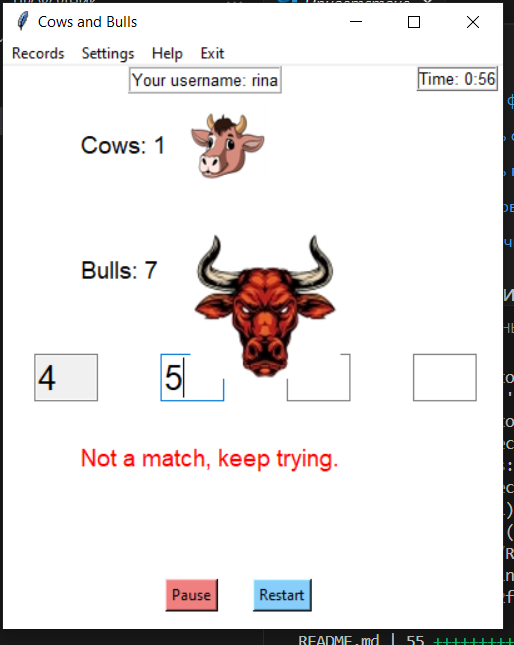
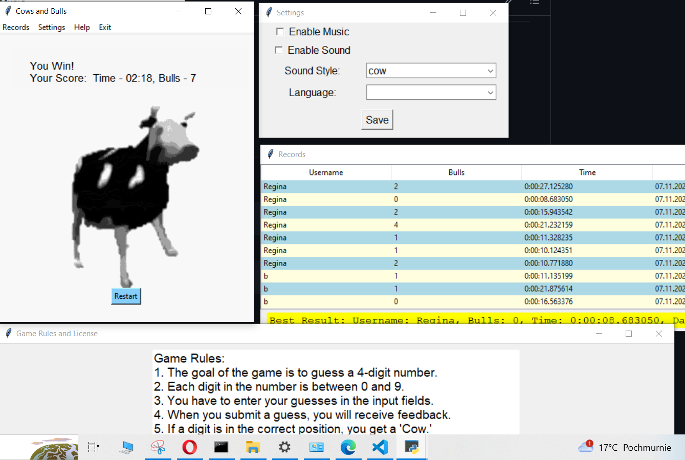

# Cows and Bulls Game

## Description
Cows and Bulls is a number-guessing game implemented using the Tkinter library in Python. The objective of the game is to guess a randomly generated four-digit number. Each correct digit in the correct position is represented by a "Cow," while each correct digit in the wrong position is represented by a "Bull." The player continues guessing until all four digits are correctly placed.





## Features
- Intuitive graphical user interface (GUI) implemented with Tkinter.
- Sound effects and background music to enhance the gaming experience.
- Game timer to track the elapsed time during gameplay.
- Pause and resume functionality for the convenience of the player.
- Win screen displaying the player's score and allowing them to restart the game.

## Instructions
1. **Guessing Digits:** Enter your four-digit guess in the input fields provided.
2. **Pause and Resume:** Use the "Pause" button to temporarily stop the game and "Resume" to continue.
3. **Game Statistics:** Keep an eye on the number of Cows and Bulls as well as the elapsed time.
4. **Winning the Game:** Achieve all Cows and win the game. Your score and time will be displayed on the win screen.

## Menu Options
- **Records:** View game records of previous players.
- **Settings:** Configure music, sound, sound style, and language preferences.
- **Help:** Access game rules and license information.
- **Exit:** Quit the game.

## Settings
- **Music and Sound:** Enable or disable background music and sound effects.
- **Sound Style:** Choose from different sound styles, including maincraft, girly, and cow.
- **Language:** Select the language for the game interface.

## Records
The game keeps track of the username, number of Bulls (incorrect guesses), time, and date for each completed game. You can view the records in the "Records" menu option.

## Game Rules and License
Access the game rules and license information through the "Help" menu option. This section provides an overview of how to play the game and includes licensing details.

## Dependencies
- Python 3.x
- Tkinter
- PIL (Python Imaging Library)
- pygame
- tkdnd (Tkinter Drag and Drop)

## How to Run
1. Ensure you have Python installed on your machine.
2. Install the required dependencies using:
   ```bash
   pip install Pillow pygame tkdnd
   ```
3. Run the game script:
   ```bash
   python main.py
   ```


Feel free to explore and enjoy the Cows and Bulls game!
